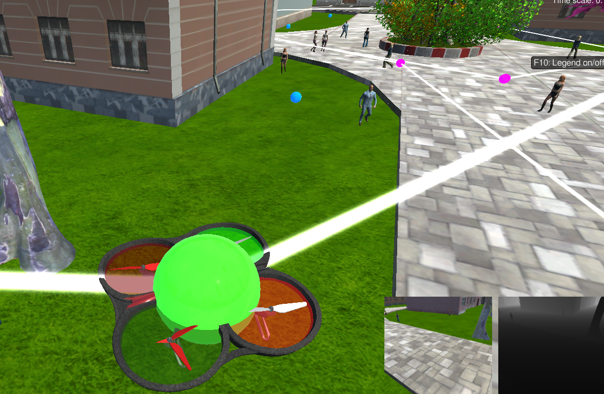
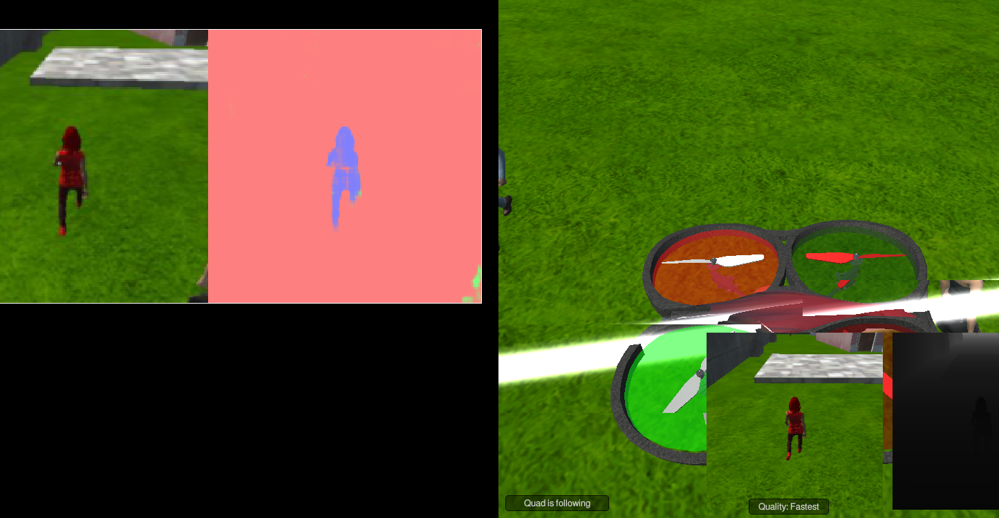

# Follow me  Writeup
#### In this project, I got to build my own fully convolutional neural network. The project's objective was to identify the "hero" target person and all the other persons in the Unity simulated world. The best part came at the end when I was able to see the drone actually follow the hero correctly.


#### Recording Data with QuadSim 
Here I have the different cameras capturing shots of the crowds: I could have been more efficient at capturing an array of perspectives by zig-zagging across the Hero's path and I could have also gathered more images with more people in the same shot. Managing python packages with a native ROS installation proved to be a bit tricky. Thankfully mini-Conda came to the rescue. I got tripped up by pretty simple errors which caused me to get pretty discouraged. Even pre-processing images became a nightmare without the correct dependencies. Eventually, I found an older version of NumPY. I've updated the Eniorment.yml files to reflect the environment I used. Early on it seemed like most of my battle was managing environments. 




### Network Architecture: 
- This project uses a fully-convolutional network where every layer is convolutional itself. This allows us to not just detect features in an image but with semantic segmentation, we are able to label each pixel and know the position of the feature in question.

#### Encoder 
- The encoder section has regular convolutions, but instead of a final fully connected layer, we have a 1x1 convolution layer and a decoder section made of reversed convolution layers.


#### Decoder
The decoder part of the model can either be composed of transposed convolution layers or bilinear upsampling layers.


#### Skip Connections
- Skip connections allow the network to keep information from layers that were lost in subsequent convolution layers.
#### Model Used
Fully Convolutional Network

- two encoder layers
- 1x1 convolution layer
- two decoder layers

- The first convolution uses a filter size of 32 and a stride of 2
- The second convolution uses a filter size of 64 and a stride of 2
- Both convolutions used the same padding

- The 1x1 convolution layer uses a filter size of 128 with stride 1

#### Hyperparameters

``` python
learning_rate = 0.001
batch_size = 100
num_epochs = 10
steps_per_epoch = 200
validation_steps = 50
workers = 2
 ```
The slack community helped me figure out hyperparameters that would get me a passing score. I experimented with very small batch sizes to make sure everything was running well and I received no errors. Then I narrowed it out  to100 due to time constraints in running my model. Though I had some intuition based on the coursework that a proper learning rate would be close to 0.001 in magnitude. Even with my modern work machine I still had overflowed from CPU when I processed anything greater than 150 in batch size. This seems to corroborate with the larger epoch size requires more space.

I found that after 10 to 15 epochs accuracy did not improve significantly. Doubling the epochs double total processing time so 10 got me to .44 final grade score.


## Project discussion and future challenges

Although the model is able to identify our hero, it is not trained to find other objects or animals, it is limited by the training data we feed the model. In other words, we can create a model to identify other objects but we would have to start from scratch and we would have to have a rich training and validation data set to be able to achieve good real-world results.

### It's actually following the right person this time!


