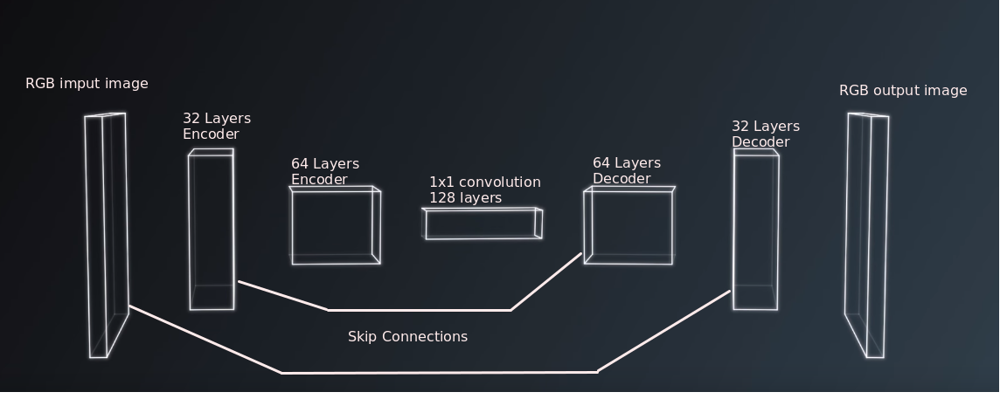

# Follow me  Writeup
#### In this project, I got to build my own fully convolution neural network. The project's task was to identify the "hero" target person and all the other persons in the Unity simulated world. The best part came at the end when I was able to see the drone actually follow the hero correctly. I will describe the model I trained to perform semantic segmentation that successfully identified the "hero" and allowed the drone to follow her.

#### Recording Data with QuadSim 
Here I have the different cameras capturing shots of the crowds: I could have been more efficient at capturing an array of perspectives by zig-zagging across the Hero's path and I could have also gathered more images with more people in the same shot. Managing python packages with a native ROS installation proved to be a bit tricky. Thankfully mini-Conda came to the rescue. I got tripped up by pretty simple errors which caused me to get pretty discouraged. Even pre-processing images became a nightmare without the correct dependencies. Eventually, I found an older version of NumPY. I've updated the Eniorment.yml files to reflect the environment I used. Early on it seemed like most of my battle was managing environments. 


### Network Architecture: 
- This project uses a fully-convolution network where every layer is convolutional itself. This allows us to not just detect features in an image but with semantic segmentation, we are able to label each pixel and know the position of the feature in question. At the heart of this system is a binary decision making process. Building layer of these decision systems allows for incredible systems that are able to perform in some cases better than a human at recognizing a feature in a dataset. Next, I will describe all the building blocks of the system.

#### Encoder 
- The encoder section is composed of individual blocks of convolutional layers. The main advantage is a reduction of the spatial dimension. Down-sampling allows a more efficient way for the model to generalize the image, separating them into different block reduces the potential for over-fitting and allows parameters to work more efficiently. 

- Each layer of the block is responsible for building on the previous layer. The
  early layer may identify shades and boundaries, while layers that come after  will be able to represent shapes and curves.

#### Batch normalization
- Batch normalization reduces the amount the hidden unit values shifts around allowing the model to be more robust to general color variation. This will be useful for instances when there might be changes in light conditions where the color may be scaled. Essentially comparing the changes in the pixels to the ones surrounding. I like to think of this part of the process as the way a system is able to learn what a brown cat looks like and is able to identify a black cat in a new dataset. 

#### 1x1 Convolutional layer
- The 1x1 layer has a kernel and stride of 1 thus is able to retain spatial information from the encoder. This allows the model to classify each pixel. Unlike fully connect layers when all the dimensions are flattened into a single matrix containing no spacial structure. This is very efficient at binary classification of an image but not useful when you want to localize an object in the image.(like our hero)



#### Skip Connections
- Skip connections connect an encoder layer to a decoder layer. They allow the network to keep information from layers that would have been lost in subsequent convolution layers. This greatly improves the model's ability to perform semantic segmentation accurately. Mainly by creating a way to preserve the feature that could have been lost as the encoder abstracted the earlier features into higher level features.


#### Decoder
The decoder part of the model can either be composed of transposed convolution layers or bilinear up-sampling layers. Each layer basically joins the layer before it to reconstruct the image to its original size. It's essentially a series of transposes that puts everything back together to it's original input size. 

#### Model Used
Fully Convolutional Network

- two encoder layers
- 1x1 convolution layer
- two decoder layers

- The first convolution uses a filter size of 32 and a stride of 2
- The second convolution uses a filter size of 64 and a stride of 2
- Both convolutions used the same padding

- The 1x1 convolution layer uses a filter size of 128 with stride 1

#### Hyper-parameters

``` python
learning_rate = 0.001
batch_size = 100
num_epochs = 10
steps_per_epoch = 200
validation_steps = 50
workers = 2
 ```
The slack community helped me figure out hyper-parameters that would get me a passing score. I experimented with very small batch sizes to make sure everything was running well and I received no errors. Then I narrowed it out  to 100 due to time constraints in running my model. Though I had some intuition based on the coursework that a proper learning rate would be close to 0.001 in magnitude. Even with my modern work machine I still had overflowed from CPU when I processed anything greater than 150 in batch size. This seems to corroborate with the larger epoch size requires more space.

I found that after 10 to 15 epochs accuracy did not improve significantly. Doubling the epochs double total processing time so 10 got me to .44 final grade score.


## Project discussion and future enhancements

Although the model is able to identify our hero, it is not trained to find other objects or animals, it is limited by the training data we feed the model. In other words, we can create a model to identify other objects but we would have to start from scratch and we would have to have a rich training and validation data set to be able to achieve good real-world results. I'd like to apply this model to different training data and see if I can decrease the training time required by training on better data. I'd love to apply this model to some read data sets and see how well it work in the real world.


### It's actually following the right person this time!


